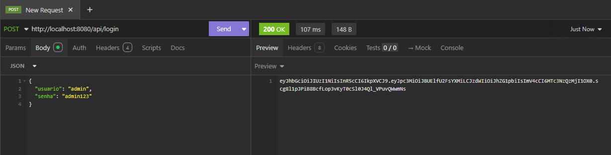
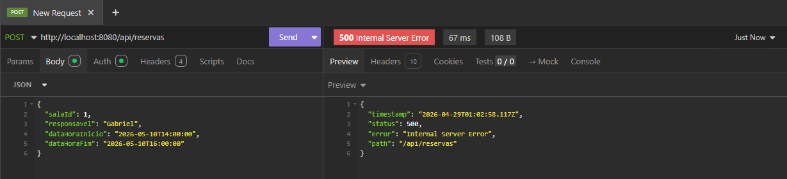

# CP2 - API de Salas de Reunião (Arquitetura SOA)

**Nome:** Vinicius Vilas Boas  
**RM:** 557843

## Objetivo do Projeto
Desenvolvimento de uma API em Java utilizando Spring Boot para o gerenciamento de salas de reunião e reservas. O projeto segue os princípios de arquitetura SOA (Service Oriented Architecture), garantindo separação de responsabilidades.

---

## Tecnologias Utilizadas
- **Java 21** & **Spring Boot 4.0 (Snapshot)**
- **Spring Security** com Autenticação **JWT** (JSON Web Token)
- **Spring Data JPA** para persistência
- **H2 Database** (Banco de dados em memória)
- **Lombok** (Produtividade)
- **Swagger/OpenAPI** (Documentação)
- **JUnit 5 / Mockito** (Testes Unitários)

---

## Arquitetura e Diferenciais
A aplicação foi estruturada em camadas:
1. **Controller:** Porta de entrada da API.
2. **Service:** Concentra 100% das regras de negócio.
3. **Repository:** Interface de comunicação com o banco H2.
4. **DTO:** Transporte seguro de dados.

### Diferenciais Implementados:
1. **Tratamento Global de Exceções:** Implementado via `@RestControllerAdvice` para retornos de erro padronizados em JSON.
2. **Logging Estruturado:** Utilização do `@Slf4j` para rastreio de operações críticas (criação de reservas, conflitos e erros).

---

## Segurança (JWT)
A API está protegida. Para testar os endpoints de Salas e Reservas, é necessário:
1. Realizar o login no endpoint `/api/login`.
2. Utilizar as credenciais padrão:
    - **Usuário:** `admin`
    - **Senha:** `admin123`
3. Copiar o Token gerado e utilizá-lo como **Bearer Token** nas próximas requisições.


---

## Regra de Negócio: Conflito de Reservas
A aplicação impede que uma sala seja reservada no mesmo horário por pessoas diferentes.  
**Lógica:** O sistema verifica se `dataHoraInicio` é anterior ao fim de uma reserva existente **E** se `dataHoraFim` é posterior ao início de uma reserva existente na mesma sala.


---

## Testes Unitários
Foram implementados testes automatizados no ReservaService cobrindo:
1. **Criação de reserva com sucesso.**
2. **Lançamento de exceção em caso de conflito de horário (Regra de Negócio)**

---

## Como Executar
1. Clone o repositório.
2. Certifique-se de ter o Java 21 instalado.
3. Execute a classe `ReservaSalasApplication.java` via IDE ou terminal (`mvn spring-boot:run`).
4. **Swagger:** [http://localhost:8080/swagger-ui.html](http://localhost:8080/swagger-ui.html)
5. **H2 Console:** [http://localhost:8080/h2-console](http://localhost:8080/h2-console) (JDBC URL: `jdbc:h2:mem:reuniao`)

---

## Exemplos de Requisição (JSON)

### 1. Login (POST /api/login)
```json
{
  "usuario": "admin",
  "senha": "123"
}
```
### 2. Criar Sala (POST /api/salas) - Requer Token
```json
{
   "nome": "Sala de Inovação",
   "capacidade": 12,
   "localizacao": "Bloco C - 3º Andar"
}
```
### 3. Criar Reserva (POST /api/reservas) - Requer Token
```json
{
   "salaId": 1,
   "responsavel": "Vinicius Vilas Boas",
   "dataHoraInicio": "2026-05-15T10:00:00",
   "dataHoraFim": "2026-05-15T11:30:00"
}
```
